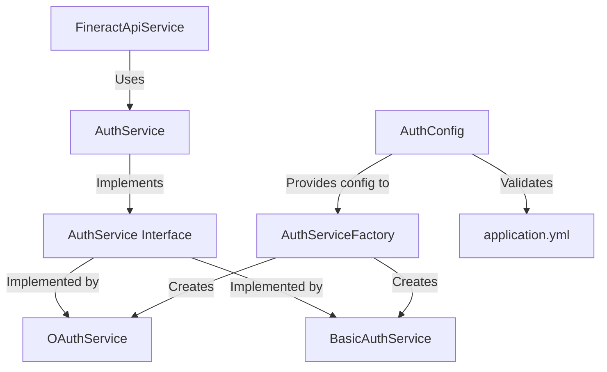

# Authentication System Architecture

## Overview
The authentication system provides a flexible way to authenticate with the Fineract API using either OAuth 2.0 (with Keycloak) or Basic Authentication. The system is designed to be easily configurable through environment variables.

## Table of Contents
- [Architecture](#architecture)
- [Core Components](#core-components)
- [Authentication Methods](#authentication-methods)
- [Configuration](#configuration)
- [Environment Variables](#environment-variables)
- [Usage Examples](#usage-examples)
- [Troubleshooting](#troubleshooting)
- [Security Considerations](#security-considerations)

## Architecture



## Core Components

### 1. AuthService Interface
**Location**: `src/main/java/com/example/fineractsetup/service/auth/AuthService.java`

Defines the contract for all authentication implementations:
- `getAuthHeaders()`: Returns HTTP headers with authentication details
- `getAuthInterceptor()`: Provides a request interceptor for RestTemplate
- `isAuthenticated()`: Verifies if the current authentication is valid

### 2. OAuthService
**Location**: `src/main/java/com/example/fineractsetup/service/auth/OAuthService.java`

Implements OAuth 2.0 authentication with Keycloak:
- Handles token acquisition and refresh
- Manages token expiration
- Implements the AuthService interface
- Configuration through `AuthConfig`

### 3. BasicAuthService
**Location**: `src/main/java/com/example/fineractsetup/service/auth/BasicAuthService.java`

Implements Basic Authentication:
- Encodes credentials in Base64
- Stateless implementation
- Implements the AuthService interface

### 4. AuthServiceFactory
**Location**: `src/main/java/com/example/fineractsetup/service/auth/AuthServiceFactory.java`

Responsible for creating the appropriate AuthService implementation:
- Determines which authentication method to use based on configuration
- Implements the Factory pattern
- Handles dependency injection of the selected service

### 5. AuthConfig
**Location**: `src/main/java/com/example/fineractsetup/config/AuthConfig.java`

Configuration class that maps to `application.yml` properties:
- Validates configuration values
- Provides type-safe access to settings
- Nested configuration classes for OAuth and Basic Auth

## Authentication Methods

### 1. OAuth (Default)
- Uses Keycloak as the OAuth2 provider
- Automatically handles token refresh
- Recommended for production environments

### 2. Basic Authentication
- Simple username/password authentication
- Useful for development and testing
- Less secure than OAuth

## Configuration

### Application Configuration (`application.yml`)

```yaml
fineract:
  api:
    url: https://localhost/fineract-provider/api/v1
    tenant: default
    
    # Authentication configuration
    auth:
      type: ${AUTH_TYPE:oauth}  # 'oauth' or 'basic'
      
      # Basic Auth configuration
      basic:
        username: ${FINERACT_API_AUTH_BASIC_USERNAME:}
        password: ${FINERACT_API_AUTH_BASIC_PASSWORD:}
      
      # OAuth configuration
      oauth:
        keycloak:
          url: ${KEYCLOAK_AUTH_URL:http://keycloak:8080/auth/realms/fineract/protocol/openid-connect/token}
          grant-type: ${KEYCLOAK_GRANT_TYPE:password}
          client-id: ${KEYCLOAK_CLIENT_ID:setup-app-client}
          client-secret: ${KEYCLOAK_CLIENT_SECRET:}
          username: ${KEYCLOAK_USERNAME:}
          password: ${KEYCLOAK_PASSWORD:}
```

## Environment Variables

### Authentication Type
- `AUTH_TYPE`: Specifies the authentication type (`oauth` or `basic`)
  - Default: `oauth`

### Basic Authentication
- `FINERACT_API_AUTH_BASIC_USERNAME`: Username for basic auth
- `FINERACT_API_AUTH_BASIC_PASSWORD`: Password for basic auth

### OAuth Configuration
- `KEYCLOAK_AUTH_URL`: Keycloak token endpoint URL
- `KEYCLOAK_GRANT_TYPE`: OAuth2 grant type (default: `password`)
- `KEYCLOAK_CLIENT_ID`: Client ID registered in Keycloak
- `KEYCLOAK_CLIENT_SECRET`: Client secret from Keycloak
- `KEYCLOAK_USERNAME`: Username for password grant
- `KEYCLOAK_PASSWORD`: Password for password grant

## Usage Examples

### 1. Using OAuth (Default)

```java
// The RestTemplate will be automatically configured with OAuth
@Autowired
private RestTemplate restTemplate;
```

Or via environment variables:

```bash
export AUTH_TYPE=oauth
export KEYCLOAK_AUTH_URL=http://keycloak:8080/auth/realms/fineract/protocol/openid-connect/token
export KEYCLOAK_CLIENT_ID=setup-app-client
export KEYCLOAK_CLIENT_SECRET=your-client-secret
export KEYCLOAK_USERNAME=admin
export KEYCLOAK_PASSWORD=admin123
```

### 2. Using Basic Auth
```yaml
# application.yml
fineract:
  api:
    auth:
      type: basic
      basic:
        username: admin
        password: password
```

Or via environment variables:

```bash
export AUTH_TYPE=basic
export FINERACT_API_AUTH_BASIC_USERNAME=admin
export FINERACT_API_AUTH_BASIC_PASSWORD=password
```

## Dependencies
- `spring-boot-starter-validation`: For configuration validation
- `spring-retry`: For retryable operations
- `spring-aspects`: Required for @Retryable annotation

## Implementation Details

### Error Handling
- Authentication failures are logged with detailed error messages
- Configuration validation provides clear error messages for missing or invalid settings
- Retry mechanism handles temporary network issues


## Troubleshooting

### Common Issues

1. **Authentication Fails**
   - Verify credentials are correct
   - Check logs for detailed error messages
   - Ensure the authentication type matches the server configuration

2. **Token Refresh Issues**
   - Verify the refresh token is valid
   - Check token expiration times
   - Ensure the client has the correct permissions

3. **Configuration Errors**
   - Check for typos in environment variables
   - Verify YAML indentation in `application.yml`
   - Ensure all required properties are set

### Logging

Set logging level to `DEBUG` for detailed authentication logs:

```yaml
logging:
  level:
    com.example.fineractsetup.service.auth: DEBUG
```

## Security Considerations

- Never commit sensitive credentials to version control
- Use environment variables or a secure secret manager for production credentials
- Regularly rotate credentials and tokens
- Use HTTPS in production environments
- Follow the principle of least privilege when configuring permissions

2. **Token Refresh Issues**
   - Verify the refresh token is valid
   - Check token expiration times
   - Ensure the client has the correct permissions

3. **Configuration Errors**
   - Check for typos in environment variables
   - Verify YAML indentation in `application.yml`
   - Ensure all required properties are set

### Logging

Set logging level to `DEBUG` for detailed authentication logs:

```yaml
logging:
  level:
    com.example.fineractsetup.service.auth: DEBUG
```

## Security Considerations

- Never commit sensitive credentials to version control
- Use environment variables or a secure secret manager for production credentials
- Regularly rotate credentials and tokens
- Use HTTPS in production environments
- Follow the principle of least privilege when configuring permissions
