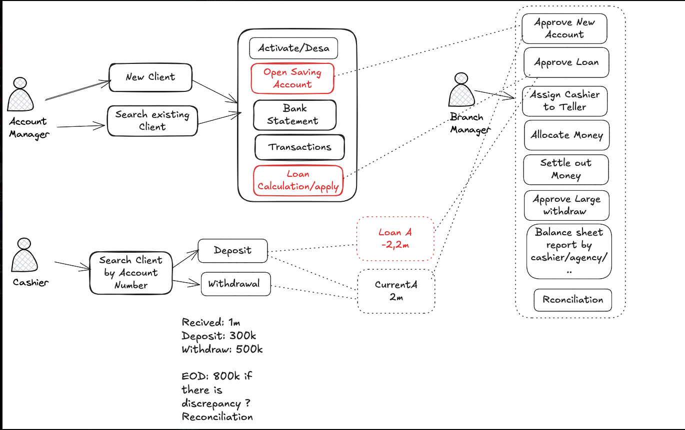

# Fineract Roles, Permissions, and Workflow

This document outlines the roles, permissions, and standard operating procedures for staff and users within the Fineract platform. Accountability and clarity are critical for all banking operations.

## 1. Role-Based Responsibilities

Here is a summary of the primary responsibilities for each of the three major roles.

### 1.1. Account Manager

The Account Manager is responsible for client relationship management and initiating financial products.

**Key Responsibilities:**
- Create new client records.
- Search for existing clients.
- Open new Savings Accounts for clients (requires Branch Manager approval).
- Calculate and apply for loans on behalf of clients (triggers Branch Manager approval workflow).
- View client bank statements.
- View client transaction histories.

### 1.2. Cashier

The Cashier is responsible for handling all client-facing financial transactions.

**Key Responsibilities:**
- Search for clients by their account number to process transactions.
- Process cash deposits into client accounts.
- Process cash withdrawals from client accounts.
- Conduct End-of-Day (EOD) reconciliation if any discrepancies are detected in daily transactions.

### 1.3. Branch Manager

The Branch Manager is responsible for oversight, approval of critical operations, and maintaining the financial integrity of the branch.

**Key Responsibilities:**
- Approve new Savings Accounts initiated by the Account Manager.
- Approve new loan applications initiated by the Account Manager.
- Assign Cashiers to specific Tellers.
- Allocate funds to Tellers/Cashiers.
- Settle and verify funds from Tellers/Cashiers at the end of the day.
- Approve large withdrawal requests that exceed standard limits.
- Generate Balance Sheet reports (can be filtered by cashier or agency).
- Perform and oversee reconciliation processes.

## 2. Process Flow

This section describes the sequence of operations for common banking tasks.

### 2.1. Client and Account Management (Account Manager)

1.  The Account Manager can either **create a new client** or **search for an existing client**.
2.  Once a client is selected, the Account Manager can:
    *   **Open a Savings Account:** This action requires approval from the Branch Manager.
    *   **Calculate or Apply for a Loan:** This action triggers an approval workflow that requires the Branch Manager's authorization.
    *   **View Bank Statement and Transaction History:** This is a read-only action for informational purposes.

### 2.2. Daily Transactions (Cashier)

1.  The Cashier searches for a client using their **account number**.
2.  The Cashier then performs one of the following transactions:
    *   **Deposit**
    *   **Withdrawal**
3.  At the end of the day, the Cashier is responsible for their daily financial summary. If a discrepancy is found during reconciliation, it must be flagged.

### 2.3. Oversight and Approval (Branch Manager)

The Branch Manager's role is primarily to oversee and authorize critical operations initiated by other staff members. This includes:

- **Approving New Accounts and Loans:** Ensuring due diligence before activation.
- **Managing Branch Staff:** Assigning cashiers to tellers.
- **Controlling Branch Liquidity:** Allocating and settling money.
- **Risk Management:** Approving large withdrawals.
- **Auditing and Reporting:** Generating reports and performing reconciliation.

## 3. Permissions Matrix (Summary)

| Permission                  | Account Manager | Cashier                | Branch Manager |
| --------------------------- | --------------- | ---------------------- | -------------- |
| Create New Client           | ✅              | ❌                     | ❌             |
| Search Client               | ✅              | ✅                     | ❌             |
| Open Savings Account        | ✅              | ❌                     | ❌             |
| Loan Calculation/Apply      | ✅              | ❌                     | ❌             |
| View Bank Statement         | ✅              | ❌                     | ❌             |
| View Transactions           | ✅              | ❌                     | ❌             |
| Deposit                     | ❌              | ✅                     | ❌             |
| Withdrawal                  | ❌              | ✅                     | ❌             |
| Approve New Account         | ❌              | ❌                     | ✅             |
| Approve Loan                | ❌              | ❌                     | ✅             |
| Assign Cashier to Teller    | ❌              | ❌                     | ✅             |
| Allocate Money              | ❌              | ❌                     | ✅             |
| Settle Out Money            | ❌              | ❌                     | ✅             |
| Approve Large Withdraw      | ❌              | ❌                     | ✅             |
| Balance Sheet Report        | ❌              | ❌                     | ✅             |
| Reconciliation              | ❌              | ⚠️ (if discrepancy) | ✅             |
